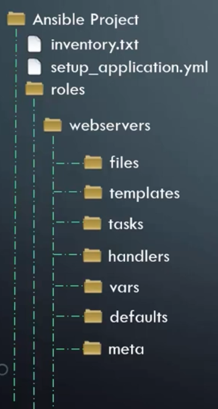

# Ansible

Ansible is an IT automation tool. It can configure systems, deploy software, and orchestrate more advanced IT tasks such as continuous deployments or zero downtime rolling updates (Ansible Document, n.d.).

For me, I just want to grab the fundamental concepts to automate my computer setting process. Now, let's get going, friends.


## 1. Inventory file

A file to define the configuration of the hosts that we are aiming to use Ansible on.

```text
# Parameters:
# - ansible_host         # ip address or domain
# - ansible_connection   # local, ssh, ...
# - ansible_port
# - ansible_user
# - ansible_ssh_pass

localhost ansible_connection=local

web ansible_host=Server1.company.com ansible_connection=ssh ansible_port=22 ansible_user=root ansible_ssh_pass=123456
db  ansible_host=Server2.company.com ansible_connection=ssh ansible_port=22
```

## 2. Ansible playbook

### Example file:

```yaml
# playbook.yaml
# Each item is a play, consituted by a group of tasks with a host or multiple hosts (use array/list if multiple)
- name: Play 1
  hosts:
    - localhost
    # - localhost2
  vars:
    - default_server: 127.0.0.1
  tasks:
    - name: Ping to servers
      ping:

    - name: Copy a simple file
      copy:
        src: ./simpletext.txt
        dest: ~/simpletext.txt

    - name: Write a simple file
      copy:
        dest: ~/simpletext2.txt
        content: |
          line 01
          localhost {{default_server}}
    
    - name: Install Slack
      snap:
        name: slack
        classic: yes
```


### Run an Ansible playbook:

Running a playbook:

```bash
ansible-playbook playbook.yaml -i inventory.txt # haven't figured out why not defining inventory.txt file is still ok
````


Running a simple command:

```bash
# ansible <hosts> -m <module> -i <inventory file>
ansible localhost -m ping -i inventory.txt # a server or group of servers' name
```

## 3. Free-form and non free-form input

Free form input means that you can specify whatever parameters in your command.

- For example:

```yaml
# ... playbook syntax
command: cat /etc/hosts
```


Non free-form input requires your command to follow Ansible format.

- For example:

```yaml
# ... playbook syntax
service:  # start postgresql
  name: postgresql
  state: started  # started, not start
  # Ansible will ensure the service to have the defined state. If not started -> start, if started -> do nothing (Idempotency)
```

__Idempotency:__ An operation is idempotent if the result of performing it once is exactly the same as the result of performing it repeatedly without any intervening actions.


## 4. Ansible modules

Module is the action to run a task. [This](https://docs.ansible.com/ansible/2.5/modules/modules_by_category.html) includes several categories:

- System
    - service: Manage services (start, stop, restart) like Mongodb, Redis, MySQL,...
    - snap
    - apt
    - ...
- Commands
- Files
- Database
- Cloud
- Windows
- More..


## 5. Ansible variables

We use variables to replace repetitive hard coding and simplify the development. There are 3 ways to define variables:

- Define directly in playbook file

```yaml
- name: Play 1
  vars:
    - default_server: 127.0.0.1
```

- Define a new yaml file

```yaml
default_server: 127.0.0.1
```

```bash
# run with the file
ansible-playbook playbook.yaml -i inventory.txt -e @variables.yaml
```

- Pass by command line

```bash
# -e flag to define variable
ansible-playbook playbook.yaml -i inventory.txt \
    -e default_server=127.0.0.1 \
    -e default_server2=127.0.0.1
```


## 6. Ansible condition

It defines a specific return value (`register`) and its subsequent task when that value matches a condition (`when`).

```yaml
- name: Play 2
  hosts:
    - all_servers
  tasks:
    - command: service httpd status
      register: command_output  # specify returning value

    - mail:
        to: Admin <system.admin@company.com>
        subject: Service Alert
        body: Service {{ansible_hostname}} is down.
      
      when: command_output.stdout.find('down') != -1 # condition using value in stdout attribute
```


## 7. Ansible loop

Loop is used when we run repetive tasks for different application (install multiple things with apt).

```yaml
- name: Play 3
  hosts: all_servers
  tasks:
    - yum:
        name: '{{ item }}'
        state: present
      with_items:
        - httpd
        - binutils
        - ksh
        - ...
```


## 8. Ansible roles

In software development, we often separate our application into multiple modules. Ansible roles do the same, instead of having a 2000 lines playbook, we can divide it into smaller ones.

You can check my `playbook-with-role.yaml` file to understand this concept.

This is my instructor's roles structure for an Ansible project.




## 9. Conclusion

This is the end of the journey. You can read more about advanced topics in Ansible's document website.

My colleague recommended this technology to me 2 years ago. At that time, I was just a naive and get-thing-done guy who could not dive into new technologies. That short-term path certainly cannot lead me in a long journey. Thankfully, my perspective has changed after a journey with AI, now I am here to present this technology to you.

I really like this tool because it helps me to automate the boring works, especially in setting up computer. It's easier than copying/pasting setting commands or writing bash scripts.


## 10. Where to go next?

- Learn more advanced concepts like:
  - Preparing Windows Server
  - Ansible-Galaxy
  - Patterns
  - Dynamic Inventory
  - Developing custom modules
  - Read through all of the modules
- Learn [advanced Ansible course](https://www.udemy.com/course/learn-ansible-advanced/)


After Ansible, there are still interesting things to learn. Keep learning!


## References

- Great course: [Ansible for the Absolute Beginner - Hands-On - DevOps](https://www.udemy.com/course/learn-ansible/)
- [Ansible Document](https://docs.ansible.com/)

